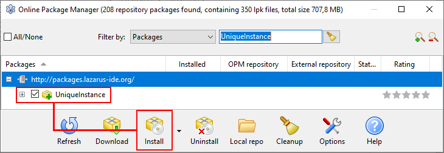

Whenever you detect a problem with **HotFrameFx** or would like to see a new feature added, feel free to submit a new issue on the project's GitHub page:

* [https://github.com/kruizer23/hotframefx/issues](https://github.com/kruizer23/hotframefx/issues)

If you're comfortable with software development, it would be even better if you implement the fix or new feature and submit a pull request for it. The following section explains how to set up the development environment.

## Development environment

**HotFrameFx** is programmed in Object Pascal using the free Lazarus IDE. [This webpage](https://www.getlazarus.org/setup/) explains how to install the Lazarus IDE on your PC.

To obtain the source code of **HotFrameFx**, you can clone the entire GIT repository to a directory on your PC:

* `git clone https://github.com/kruizer23/hotframefx.git HotFrameFx`

If you first [fork the GitHub project](https://docs.github.com/en/get-started/quickstart/fork-a-repo), you can directly submit pull requests for your changes.

Alternatively, you can download everything as a ZIP-file from the project's [GitHub page](https://github.com/kruizer23/hotframefx).

You can find all source code in the `sources/` subdirectory, including the Lazarus IDE project file:

* `sources/HotFrameFx.lpi`

Before opening this project file in the Lazarus IDE, first install the `UniqueInstance` package. Select *Package* &rarr; *Online Package Manager* from the Lazarus program menu. In the dialog that appears, locate the `UniqueInstance` package and install it:

Afterwards, you can open the `sources/HotFrameFx.lpi` project file in the Lazarus IDE and start your software development work.

