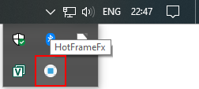
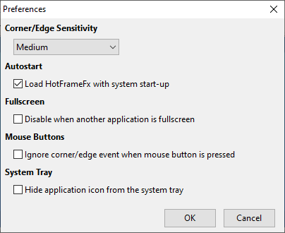

This section helps you get started with setting up and using **HotFrameFx**.

## User interface overview

When you start **HotFrameFx** for the first time, it always shows the application's main window. On consecutive starts, it automatically minimizes itself to the system tray:

Clicking the icon in the system tray, opens the application's main window. It presents you with a blue rectangle, representing your primary monitor. To highlight the corners and edges, they are shown in a darker blue tone. Hover your mouse over one of the corners or edges and the text in the middle shows you the currently configured action:

## First steps

By default the following two actions are configured for demonstration purposes:

* Top-left hot corner: <kbd>Super</kbd>+<kbd>Tab</kbd> keystrokes. This is the Windows 10 keyboard shortcut for opening the task view. 
* Bottom edge: <kbd>Alt</kbd>+<kbd>Ctrl</kbd>+<kbd>Tab</kbd> keystrokes. This is the Windows 10 keyboard shortcut for viewing all open applications.

Note the the <kbd>Super</kbd> key basically means the Windows key (<kbd>⊞</kbd>) on your keyboard. 

Go ahead and give them a try. Move your mouse cursor all the way to the bottom of your primary screen. Almost as if you want to move it outside or your screen and hold it there briefly. Here's what it looks like for me, while I'm writing this user manual:

Likewise, move your mouse cursor to the top-left of your primary screen and see if you can get the task view to open up.

## Configure actions

The default actions, for opening the task view and viewing all open applications, might not be your preferred actions. You can of course customize these to something else. **HotFrameFx** supports two action types:

1. Sending keystrokes.
2. Launching an application.

To configure an action, open the main window and click on the corner or edge. This shows to action configuration dialog for that particular corner or edge. To configure a keystroke, select the key combination using the checkboxes and the selection box:

Alternatively, you can click the *Grab*-button. This opens up a dialog that can automatically detect and record the key presses:

Instead of sending keystrokes, you can also configure a hot corner or edge action to start an application on your PC. In this case, switch to *Launch Application* and click the browse button to select the application to start:

## Common keyboard shortcuts

Here's a brief list of keyboard shortcuts that are commonly configured in combination with hot corners and edges:

| Description                            | Keyboard shortcut                                      |
| -------------------------------------- | ------------------------------------------------------ |
| Show / hide the task view              | <kbd>Super</kbd> + <kbd>Tab</kbd>                      |
| Show all open applications             | <kbd>Alt</kbd> + <kbd>Ctrl</kbd> + <kbd>Tab</kbd>      |
| Show / hide the desktop                | <kbd>Super</kbd> + <kbd>D</kbd>                        |
| Minimize all windows                   | <kbd>Super</kbd> + <kbd>M</kbd>                        |
| Open start menu                        | <kbd>Super</kbd>                                       |
| Open search                            | <kbd>Super</kbd> + <kbd>S</kbd>                        |
| Open file explorer                     | <kbd>Super</kbd> + <kbd>E</kbd>                        |
| Open quick link menu                   | <kbd>Super</kbd> + <kbd>X</kbd>                        |
| Open action center                     | <kbd>Super</kbd> + <kbd>A</kbd>                        |
| Switch to virtual desktop on the right | <kbd>Ctrl</kbd> + <kbd>Super</kbd> + <kbd>&rarr;</kbd> |
| Switch to virtual desktop on the left  | <kbd>Ctrl</kbd> + <kbd>Super</kbd> + <kbd>&larr;</kbd> |

## Application preferences

To change the application preferences, select *File* &rarr; *Preferences* from the menu. This opens up the *Preferences* dialog, where you can change application settings:

Through the *Corner/Edge Sensitivity* selection box you can change the sensitivity of the corners and edges. A low sensitivity means you need to keep your mouse cursor longer in the corner or edge, before the configured action triggers. 

With the *Autostart* checkbox, you can select if you want to automatically start **HotFrameFx** each time you log into Windows. If you plan on using **HotFrameFx** on a regular basis, I recommend enabling this option.

With the *Fullscreen* checkbox, you can select if you want to disable hot corner and edge actions, if another application is running in fullscreen mode. For example while gaming.

With the *Mouse Buttons* checkbox, you can enable a feature that prevents the corner and edge actions to trigger, in case one of the mouse buttons is currently pressed.

## User settings

When you start and exit **HotFrameFx**, it automatically loads and saves your configuration in a user settings file called `HotFrameFx.cfg`, located in directory:

* `C:\Users\<user name>\AppData\Local\HotFrameFx\`

 It's recommended to include this file, each time you backup the personal files on your PC. If you're not yet backing up your pesonal files, consider installing a tool such as [Veeam Agent](https://www.veeam.com/windows-endpoint-server-backup-free.html). It's free and you can configure it to automatically run backups for you in the background.

