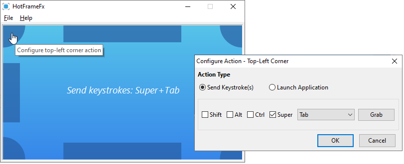

**HotFrameFx** is a system tray utility for configuring hot corner and edge actions:

## Background

Ever used anything other than the Windows operating system? If you've used macOS or a modern Linux desktop environment such as Gnome or KDE, you might have grown accustomed to something called hot corners and hot edges. It's when you send your mouse cursor into a screen corner or edge and fancy stuff happens. Such as showing an overview of all currently opened applications or minimizing all application windows. It takes a bit of getting used to at first, but once you get the hang of it, you don't want to miss it anymore...until you come back to the Windows operating system. 

At this point in time, Windows 8, 10 and 11 do not offer a build in feature for hot corners and hot edges. Luckily, you can find third-party utilities that bring this functionality: *Hot Corners WX* and *WinXCorners* to name just a few. Both excellent tools if you just need hot corners. Unfortunately, these tools do not support hot edges. So I thought: What to do now? And the idea to develop my own little utility was born. The result: **HotFrameFx**. I figured that others might find such a tool handy as well, so I decided to make it open source and available for free. A brief overview of **HotFrameFx**'s features:

* Supports configurable actions for both corners and edges on the primary monitor.
* You can configure a keystroke combination or the launch of an application as the action.
* Five different corner and edge sensitivity levels.
* Runs from the system tray to not unnecessarily clutter the task bar.
* Can be configured to automatically start with Windows.
* Open source and completely free.

## Installation

Head over to the [releases page](https://github.com/kruizer23/hotframefx/releases) and download the latest version. After extracting the downloaded zip-file, you'll end up with the installer's `.exe` file. Simply double-click this file from your Windows explorer to start the installation. Afterwards, you can find a shortcut to **HotFrameFx** in your start menu to open the application.

For additional information on using **HotFrameFx**, either play around and experiment with it or continue reading in the [getting started](getting_started.md) section.

## System requirements

* 64-bit Windows 10 or 11
* 2048 MB of RAM
* 20 MB of free disk space
* 1600x900 screen resolution or higher

